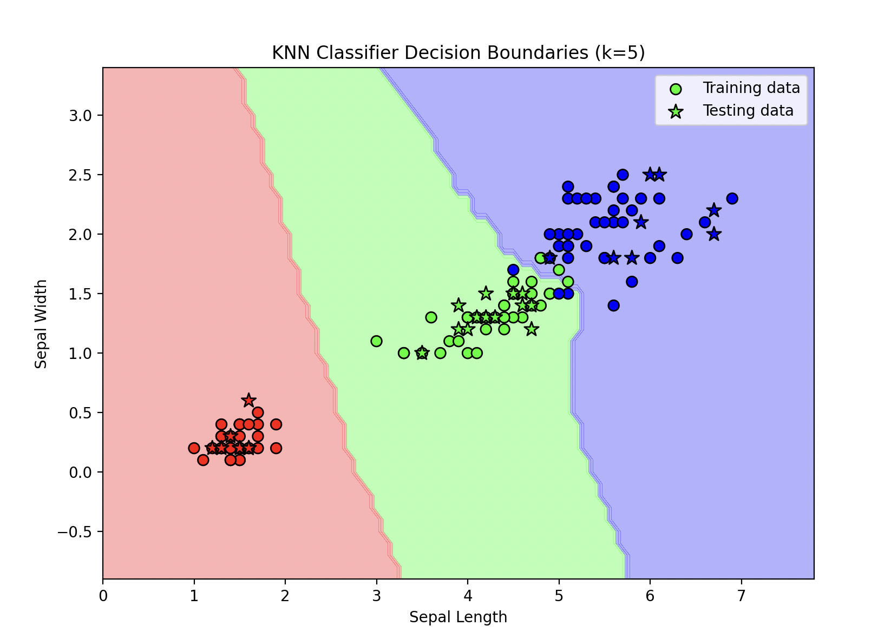

# K-Nearest Neighbors (KNN) Classifier Implementation

This repository contains an implementation of the K-Nearest Neighbors (KNN) algorithm for classification tasks, applied to the Iris dataset. It includes the core KNN logic and demonstrates its usage on the Iris dataset from sklearn.
## Project Overview

KNN is a simple, yet powerful machine learning algorithm for classification that predicts the class of a sample based on the majority class of its nearest neighbors. This implementation includes:
- A custom KNNClassifier class that implements the KNN algorithm from scratch.
- Evaluation of the model's accuracy on the Iris dataset using scikit-learn’s train_test_split.
- Basic visualization of the Iris dataset’s features to get a better understanding of the data.
## Features

- Euclidean Distance Calculation: Measures the distance between data points to find the closest neighbors.
- Majority Voting: Classifies a point by taking a majority vote of its nearest neighbors.
- Data Visualization: Plots a scatter plot of the data for visual analysis.
- Accuracy Evaluation: Measures the model's performance on the test set.

## Example Output
```
Number of datapoints: 150
Training datapoints: 120
Testing datapoints: 30
Predicted class labels for the test data: [0, 1, 2, 1, ...]
The accuracy is: 0.9667
```


## How It Can Be Improved
- Cross-Validation for Optimal k Selection: Implement cross-validation to automatically select the best k based on validation accuracy.
- Handling More Data: Allow the user to load custom datasets from CSV files.
- Plotting Decision Boundaries: Visualize decision boundaries to better understand the classifier's behavior.
- Hyperparameter Tuning: Experiment with different distance metrics like Manhattan or Minkowski to improve performance.

